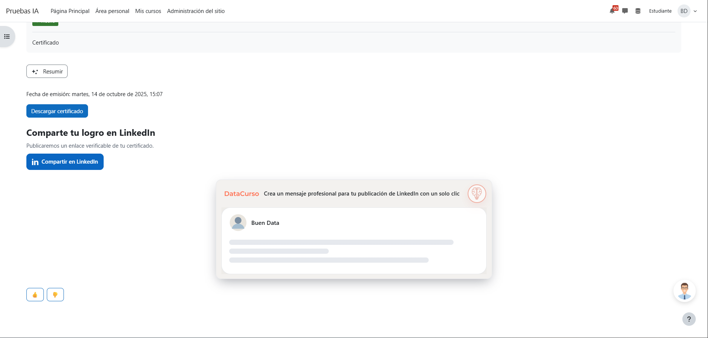

# Share Certificate AI (local_socialcert)

A Moodle plugin that adds an **“Add certificate to LinkedIn”** button to **Custom certificate** activities and, optionally, generates a **professional AI message** ready for your LinkedIn post. All with **one click** for the learner.

> **Dependency:** Requires [`mod_customcert`](https://moodle.org/plugins/mod_customcert). It doesn’t modify *Custom certificate*; it only adds a contextual action.

---

## Features

* **LinkedIn Add-to-profile** button on each issued certificate (from *Custom certificate*).
* **Provider AI** integration (another Buen Data plugin) to **suggest LinkedIn post copy**.
* Public verification link (`verify.php?code=...`) included automatically.
* Complies with Moodle’s privacy API; **no additional personal data** is stored.
* Languages: English (default), Spanish, German, French, Portuguese, Indonesian, and Russian.

---

# Prerequisites

- **Moodle 4.5**
- Install the Moodle AI provider **“DataCurso AI Provider.”**  
  Download it for free from [https://moodle.org/plugins/aiprovider_datacurso/versions](https://moodle.org/plugins/aiprovider_datacurso/versions).
- In the DataCurso AI Provider settings, configure a valid license key as documented at  
  [https://docs.datacurso.com/index.php?title=Datacurso_AI_Provider#Getting_license_keys](https://docs.datacurso.com/index.php?title=Datacurso_AI_Provider#Getting_license_keys).
- **"Custom certificate"** (https://moodle.org/plugins/mod_customcert) (recommended minimum: **2024042212**).

> **IMPORTANT:** This plugin will not function unless the DataCurso AI Provider plugin is installed **and** licensed.

## Pre-requisites

* **Moodle 4.5** (recommended minimum: **2025100201**) or later.
* **`mod_customcert`** (recommended minimum: **2024042212**).
* **Provider AI** to auto-generate the LinkedIn post message (version **2025100201**) — optional.

---

## Installing via ZIP upload

1. Log in as **administrator** and go to **Site administration → Plugins → Install plugins**.
2. Upload the plugin **ZIP**.
3. Review the validation report and **complete the installation**.

## Installing manually

1. Copy this directory to:

   ```
   {your/moodle/dirroot}/local/socialcert
   ```

2. Log in as administrator and visit **Site administration → Notifications** to complete the upgrade,
   or run from CLI:

   ```bash
   php admin/cli/upgrade.php
   ```

---

## Plugin Configuration

Once installed, configure the plugin as follows:

1. **Sign in as a site administrator.**
2. Navigate to **Site administration → Plugins → Local plugins → Share Certificate AI**.
3. In **General settings**, review and complete:

   * **Organization name** (`organizationname`) — *recommended*.

     * Used in the suggested LinkedIn text and as the certificate issuer name.
     * For best results, enter the **exact name as it appears on LinkedIn** (same casing, spacing, and accents).
   * **LinkedIn Organization ID** (`organizationid`) — *optional*.

     * Use only if you post on behalf of a **LinkedIn Company Page**.
     * If left empty, LinkedIn’s **default behavior** applies (user profile or default context).
   * **Enable AI** (`enableai`) — *global toggle*.

     * Turn on to show the **Generate text for LinkedIn** button on the certificate page. If off, the panel won’t offer the suggested text.
4. Click **Save changes**.
5. *(Recommended)* Go to **Site administration → Development → Purge all caches** to ensure the frontend reflects the new settings.

### How to find your LinkedIn Organization ID

You must be an **administrator** of your institution’s LinkedIn Page.

1. Open your organization’s LinkedIn Page in admin view.
2. Copy the **numeric ID** from the URL.

Example:

```
https://www.linkedin.com/company/61803398/admin/...
```

In this example, the **Organization ID** is `61803398`.

### Organization name recommendations

* Use the **exact public name** of the LinkedIn Page (match capitalization, accents, and spaces).
* This helps ensure consistent behavior across the plugin.

---


---

## Using it in a course

1. **Add a Custom certificate** activity to your course.
2. Make sure the learner **already has an issued certificate** (entry exists in `customcert_issues`).
3. The **Add to LinkedIn profile** action will appear in the activity menu **only when**:

   * An **issue** exists for the current user, **and**
   * A valid **`organizationid`** is configured in the plugin settings.

> **Important**
>
> * If **no certificate has been issued**, the action is blocked and an **error is shown**.
> * In that case, the plugin **will not take the user to LinkedIn** and the share flow is not available until the certificate is issued.


---

## Add to LinkedIn (one-click)

1. On the certificate page, click **Share on LinkedIn**.
 
   

3. A LinkedIn window opens with your certificate details **already filled in** (title, issuer, issue date, credential ID, and verification URL). Review and click **Save/Add**.
 
   

> If you’re not signed in to LinkedIn, you’ll be asked to **log in** first.
> If the button doesn’t appear, make sure your certificate has been **issued** and your site admin has set the **organization name/ID**.


---
## Generate a LinkedIn post suggestion (AI)

1. On the certificate page, find the **SocialCert** card and the **AI button** (brain icon).
 
   

3. **Click the AI button.** The component will **expand** and show a preview with the **suggested LinkedIn message**.
   

4. Review the suggested text. You can **adjust it** if you want (the plugin does not publish for you).

5. Click **Copy** (clipboard icon) in the panel’s corner to copy the text.
 
   

6. Open LinkedIn, **paste** the copied message into your post, and publish.

---

## License

2025 Data Curso LLC <https://datacurso.com>

This program is free software: you can redistribute it and/or modify it under
the terms of the GNU General Public License as published by the Free Software
Foundation, either version 3 of the License, or (at your option) any later
version.

This program is distributed in the hope that it will be useful, but WITHOUT ANY
WARRANTY; without even the implied warranty of MERCHANTABILITY or FITNESS FOR A
PARTICULAR PURPOSE.  See the GNU General Public License for more details.

You should have received a copy of the GNU General Public License along with
this program.  If not, see <https://www.gnu.org/licenses/>.